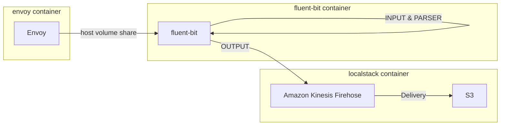

## README

Send `Rnvoy access log` to S3 bucket as JSON format.
Envoy logs are collected by fluentbit and sent to firehose, then firehose sends them to S3 bucket.

Envoy access log is json formatted, therefore fluent-bit do nothing and send it to firehose.

Envoy log format
```yaml
static_resources:
  listeners:
    - name: listener_0
      filter_chains:
        - filters:
            - name: envoy.filters.network.http_connection_manager
              typed_config:
                access_log:
                  - name: envoy.access_loggers.file
                    typed_config:
                      "@type": type.googleapis.com/envoy.extensions.access_loggers.file.v3.FileAccessLog
                      # path: /dev/stdout
                      path: /var/log/envoy/access.log
                      log_format:
                        text_format: |
                          [%START_TIME%] "%REQ(:METHOD)% %REQ(X-ENVOY-ORIGINAL-PATH?:PATH)% %PROTOCOL%" %RESPONSE_CODE% %RESPONSE_FLAGS% %BYTES_RECEIVED% %BYTES_SENT% %DURATION% %RESP(X-ENVOY-UPSTREAM-SERVICE-TIME)% "%REQ(X-FORWARDED-FOR)%" "%REQ(USER-AGENT)%" "%REQ(X-REQUEST-ID)%" "%REQ(:AUTHORITY)%" "%UPSTREAM_HOST%"\n

```

## Flowchart



# Sample payload

Envoy access log

```json
{"upstream_service_time":null,"upstream_transport_failure_reason":null,"connection_termination_details":null,"request_id":"94fa048f-5005-4b86-bbf0-e1c1decf602c","route_name":null,"upstream_host":null,"upstream_local_address":null,"method":"GET","response_code_details":"direct_response","duration":0,"authority":"localhost:8080","path":"/favicon.ico","downstream_remote_address":"172.25.0.1:34956","protocol":"HTTP/1.1","bytes_received":0,"x_forwarded_for":null,"bytes_sent":17,"start_time":"2023-08-03T09:41:39.154Z","upstream_cluster":null,"user_agent":"Mozilla/5.0 (Windows NT 10.0; Win64; x64) AppleWebKit/537.36 (KHTML, like Gecko) Chrome/112.0.0.0 Safari/537.36","response_code":200,"requested_server_name":null,"downstream_local_address":"172.25.0.2:10000","response_flags":"-"}
```

S3 placed log

```json
{"authority":"localhost:8080","bytes_received":0,"bytes_sent":17,"connection_termination_details":null,"downstream_local_address":"172.25.0.2:10000","downstream_remote_address":"172.25.0.1:34956","duration":0,"method":"GET","path":"/favicon.ico","protocol":"HTTP/1.1","request_id":"94fa048f-5005-4b86-bbf0-e1c1decf602c","requested_server_name":null,"response_code":200,"response_code_details":"direct_response","response_flags":"-","route_name":null,"start_time":"2023-08-03T09:41:39.154Z","upstream_cluster":null,"upstream_host":null,"upstream_local_address":null,"upstream_service_time":null,"upstream_transport_failure_reason":null,"user_agent":"Mozilla/5.0 (Windows NT 10.0; Win64; x64) AppleWebKit/537.36 (KHTML, like Gecko) Chrome/112.0.0.0 Safari/537.36","x_forwarded_for":null}
```
