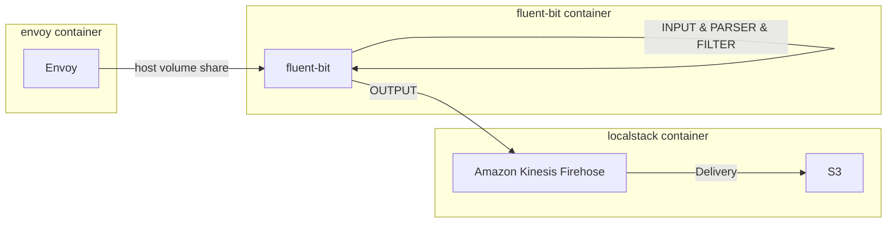

## README

Send `Rnvoy access log` to S3 bucket as JSON format.
Envoy logs are collected by fluentbit and sent to firehose, then firehose sends them to S3 bucket.

Envoy access log is text formatted, therefore fluent-bit parse it and convert to JSON format.

Envoy log format
```yaml
static_resources:
  listeners:
    - name: listener_0
      filter_chains:
        - filters:
            - name: envoy.filters.network.http_connection_manager
              typed_config:
                access_log:
                  - name: envoy.access_loggers.file
                    typed_config:
                      "@type": type.googleapis.com/envoy.extensions.access_loggers.file.v3.FileAccessLog
                      # path: /dev/stdout
                      path: /var/log/envoy/access.log
                      log_format:
                        text_format: |
                          [%START_TIME%] "%REQ(:METHOD)% %REQ(X-ENVOY-ORIGINAL-PATH?:PATH)% %PROTOCOL%" %RESPONSE_CODE% %RESPONSE_FLAGS% %BYTES_RECEIVED% %BYTES_SENT% %DURATION% %RESP(X-ENVOY-UPSTREAM-SERVICE-TIME)% "%REQ(X-FORWARDED-FOR)%" "%REQ(USER-AGENT)%" "%REQ(X-REQUEST-ID)%" "%REQ(:AUTHORITY)%" "%UPSTREAM_HOST%"\n

```

## Flowchart



# Sample payload

Envoy access log

```
[2023-08-03T06:39:38.346Z] "GET / HTTP/1.1" 200 - 0 17 0 - "-" "Mozilla/5.0 (Windows NT 10.0; Win64; x64) AppleWebKit/537.36 (KHTML, like Gecko) Chrome/112.0.0.0 Safari/537.36" "612a6ade-62a7-4361-8b96-0d4a05774dc7 "localhost:8080" "-"\n
```

S3 placed log

```json
{"authority":"localhost:8080","bytes_received":"0","bytes_sent":"17","code":"200","duration":"0","method":"GET","path":"/favicon.ico","protocol":"HTTP/1.1","request_id":"612a6ade-62a7-4361-8b96-0d4a05774dc7","response_flags":"-","start_time":"2023-08-03T06:39:38.346Z","upstream_host":"-","user_agent":"Mozilla/5.0 (Windows NT 10.0; Win64; x64) AppleWebKit/537.36 (KHTML, like Gecko) Chrome/112.0.0.0 Safari/537.36","x_envoy_upstream_service_time":"-","x_forwarded_for":"-"}
```
